# Coffee Shop - Flutter UI App

☕️ Coffee Shop App – Explore the World of Specialty Coffee
Coffee is a Flutter UI application designed to take you on a rich and elegant coffee journey. It features a handpicked selection of specialty coffees from around the world, each presented with detailed information such as origin, tasting notes, and brewing techniques.

With its user-friendly and aesthetically refined interface, both beginners and coffee lovers can enjoy a seamless browsing experience. The sleek UI enhances not only visual appeal but also interaction, ensuring a smooth and delightful user journey.

## Screenshots
Here are some glimpses of "coffee shop" app in action:

| **Welcome**          | **Onboarding-1**         | **Onboarding-2** |
|--------------------|--------------------|--------------------|
|  |  |  |

| **Onboarding-3**          | **Create Account**         | **Sing In** |
|--------------------|--------------------|--------------------|
|  |  |  |

| **Verify Code**          | **New Password**         | **Complete Your Profile** |
|--------------------|--------------------|--------------------|
|  |  |  |

| **Allow Location Access**          | **Allow Notifications Access**         | **Enter Location** |
|--------------------|--------------------|--------------------|
|  |  | 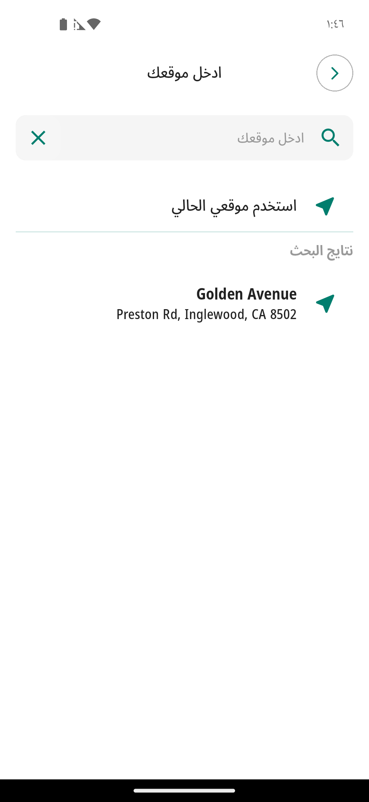 |

| **Home**          | **Wishlist**         | **Profile** |
|--------------------|--------------------|--------------------|
| 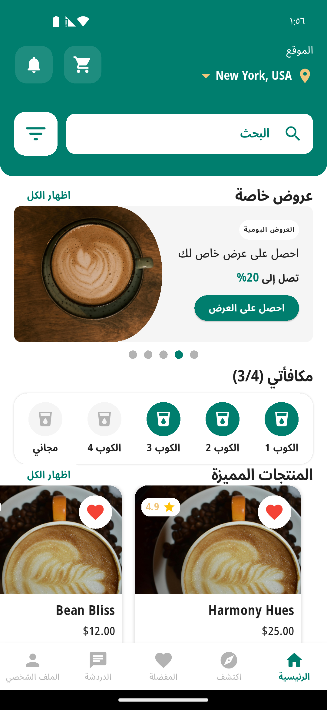 | 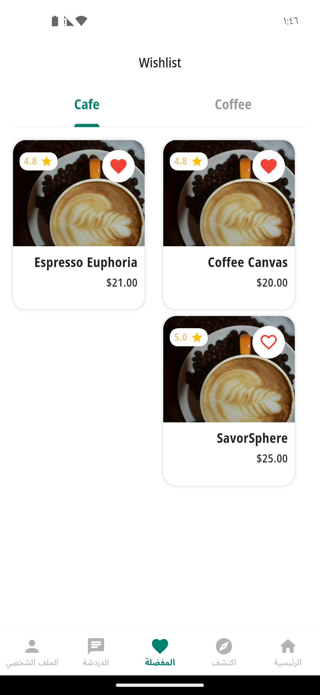 | 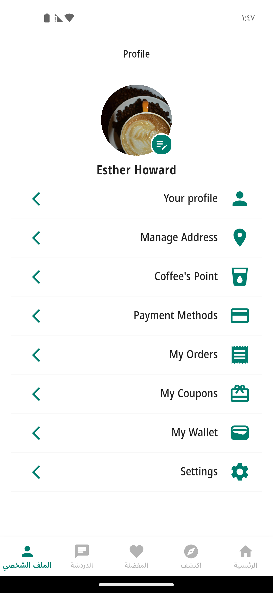 |
<!-- | test | test | test | -->

| **Coupon**          | **Wallet**         | **Add Card** |
|--------------------|--------------------|--------------------|
|  | 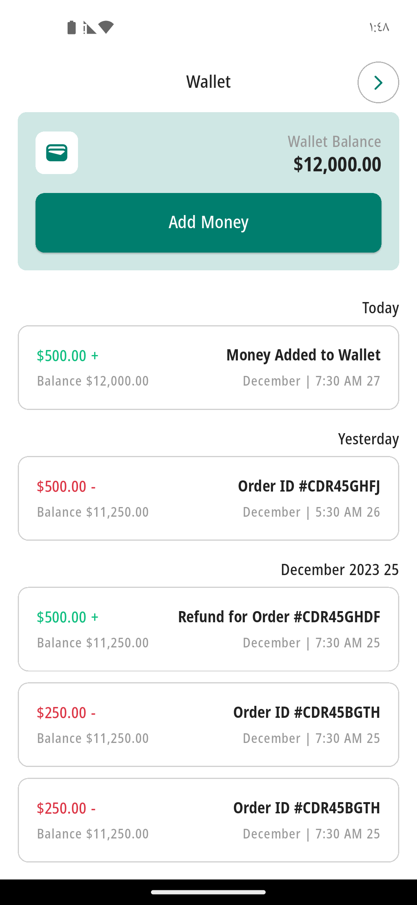 | 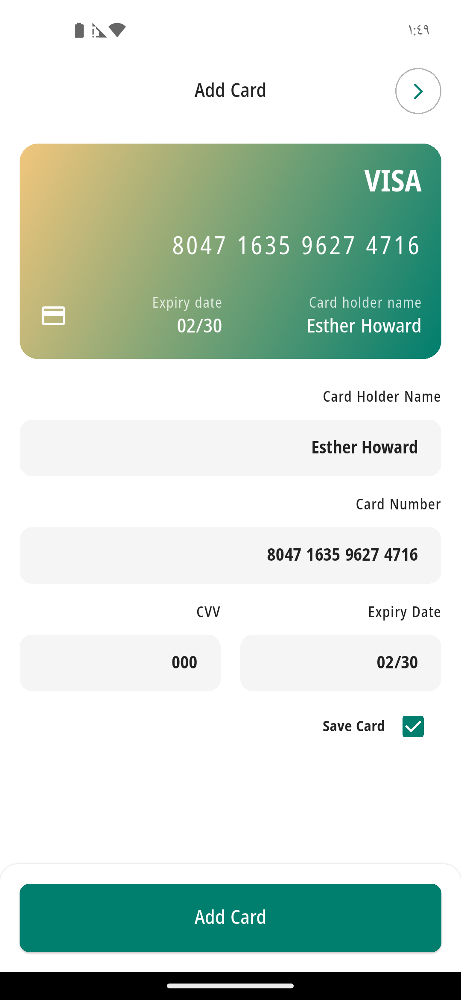 |
<!-- | test | test | test | -->

| **Successfully**          | **Dateils Product**         | **My Cart** |
|--------------------|--------------------|--------------------|
| 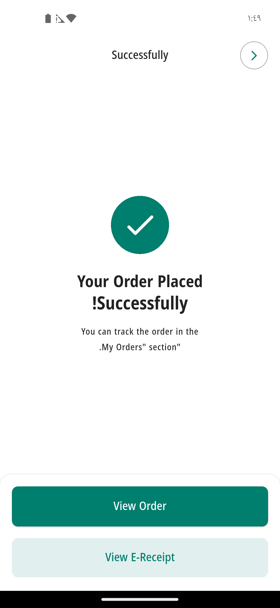 | 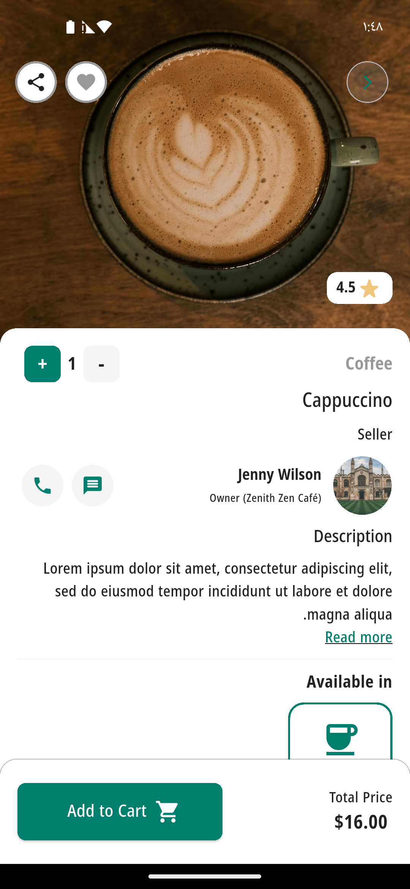 | 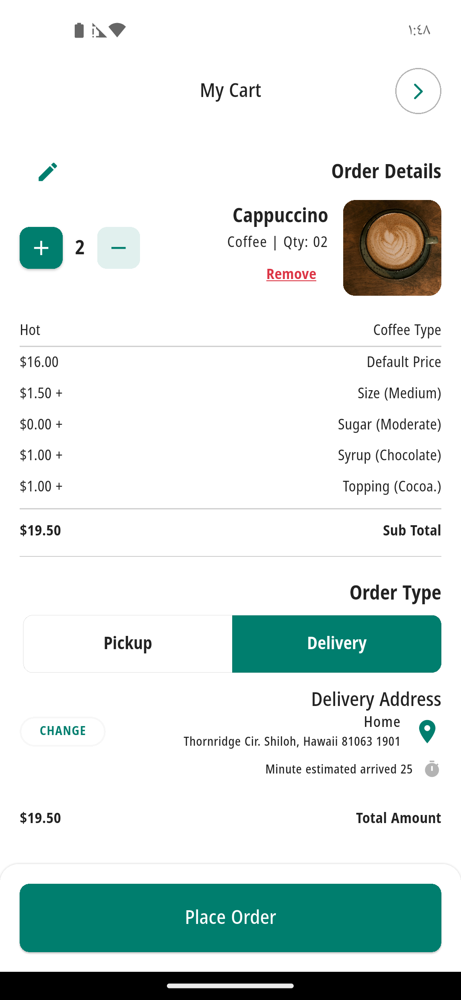 |
<!-- | test | test | test | -->

| **Write Review**          | **Reviews**         | **Test** |
|--------------------|--------------------|--------------------|
| 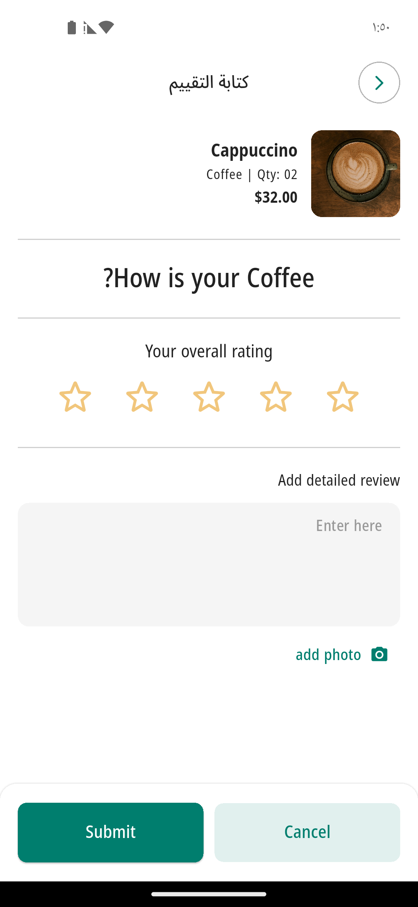 | 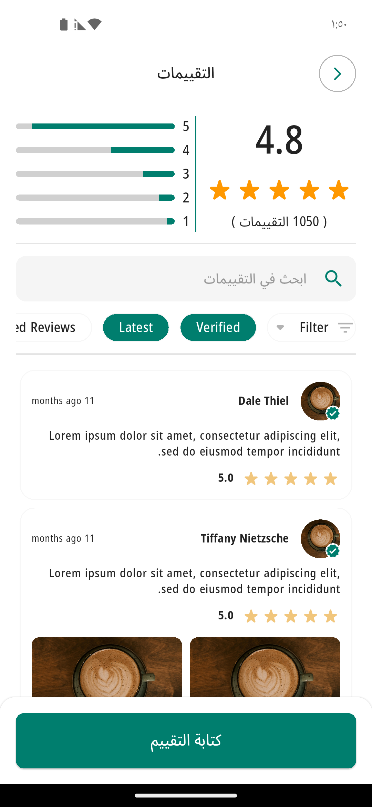 |  |
<!-- | test | test | test | -->

## Getting Started

To get started with the Coffee Shop app, follow these steps:

1. **Prerequisites:** Ensure you have Flutter installed on your system. If not, you can install it from the official Flutter website.

2. **Clone the Repository:** Clone this repository to your local machine using the following command:

3. **Install Dependencies:** Navigate to the project directory and install the required dependencies:

4. **Run the App:** Now, you can run the app on your connected device or emulator:

## Contributing

We welcome contributions from the community! If you'd like to contribute to the app, follow these steps:

1. Fork this repository.

2. Create a new branch for your feature or bug fix.

3. Make your changes and commit them with descriptive commit messages.

4. Push your changes to your forked repository.

5. Create a pull request to the `main` branch of this repository.

We'll review your pull request and merge it if everything looks good!

## Contact

If you have any questions or suggestions regarding the Coffee Shop app, feel free to contact us at hosain3010@gmail.com 

---

Thank you for joining us on this delightful coffee adventure! We hope you enjoy exploring the world of specialty coffees with our app. Happy sipping! ☕️
